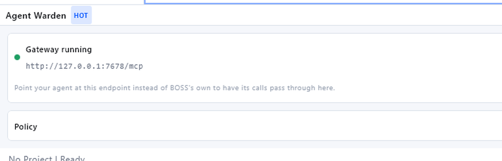

# Validation

What has been tested, how, and what has not been.

## Automated: 149 tests

```bash
./gradlew test
```

| Suite | Tests | What it pins |
|---|---:|---|
| `McpGatewayTest` | 26 | Wire behaviour over real sockets against a recording fake upstream |
| `WardenRuntimeTest` | 24 | Orchestration end to end with no BOSS running |
| `SessionReportTest` | 19 | What the report must never omit and never claim |
| `SessionRecorderTest` | 16 | Concurrency, capping, and event collapsing |
| `WardenMcpToolsTest` | 15 | The agent-facing contract, including what is deliberately absent |
| `PolicyTest` | 11 | The decision matrix, exhaustively |
| `ToolCatalogTest` | 10 | Classification, including the bug found in live testing |
| `ApprovalCoordinatorTest` | 11 | Serialisation, timeouts, and fail-closed behaviour |
| `RedactorTest` | 9 | Redaction, written from the leak backwards |
| `GrantBookTest` | 8 | Expiry against an injected clock, and thread safety |

Three choices worth explaining.

**The gateway is tested over real sockets, not a mocked HTTP layer.** The
guarantees are about bytes on a wire. A mock would pass while the real server
dropped a session header or answered in a shape agents read as a crash.

**The central assertions are negative.** "A refused call never reaches upstream"
cannot be established against a live BOSS without trusting that nothing else on
the machine made the call. `FakeUpstream` records every request it receives, so
the question becomes a fact about a list.

**Expiry and timing are driven by injected clocks.** Nothing in the suite sleeps,
so the whole run takes about fifteen seconds.

## Mutation testing on the security-critical branches

Passing tests are not evidence that the tests would catch a regression. Two
mutations were applied to `Profile.decide` and the suite re-run.

| Mutation | Killed by |
|---|---|
| Hard denial stops denying (`capability in hardDenied` → `false`) | 7 tests |
| The explicit `UNKNOWN` branch is removed | **0 tests** |

The second was a real gap, and it is worth reading carefully because the
underlying code was correct.

`UNKNOWN` is the highest ordinal in `Capability`, and all three shipped profiles
have a ceiling below it, so they reach `Ask` through the ordinal comparison whether
or not the explicit branch exists. The mutation was semantically equivalent for
every profile the tests exercised. But the branch is what makes the documented
promise true - "never returns `Allow` for `UNKNOWN`, whatever the ceiling" - for a
profile whose ceiling *is* `UNKNOWN`, and no test constructed one.

`PolicyTest.a ceiling of UNKNOWN still does not auto-allow unclassified tools` now
does, and it kills the mutant.

## Manual: against a running BossConsole 9.5.7

Local build from source, default plugin set, local Supabase backend.

**The plugin loads.**

```text
07:54:45 INFO DynamicPluginLoader: Plugin loaded successfully
         | {pluginId=ai.rever.boss.plugin.dynamic.warden, version=0.2.0}
07:54:45 INFO McpToolRegistry: MCP tool provider registered
         | {providerId=ai.rever.boss.plugin.dynamic.warden, tools=3}
07:54:45 INFO AgentWarden: Agent Warden registered | {}
07:54:46 INFO McpGateway: MCP gateway listening
         | {port=7678, upstream=http://127.0.0.1:7677/mcp}
```

**The panel renders.**



**The gateway proxies faithfully.** `tools/list` through 7678 returns the same
tools a direct connection to 7677 returns, minus the ones policy hides, plus this
plugin's own three.

**Policy is enforced end to end.** Driven with curl against the live gateway,
default `Read only` profile:

```text
[1] warden_get_policy    -> the agent is told what it may do, and that it cannot change it
[2] warden_log_intent    -> "Recorded."
[3] list_tabs            -> forwarded, real answer returned, no prompt
[4] manage_tools(enable) -> "Change its own permissions is refused by the 'Read only' profile."
[5] warden_session_summary:
      Tool calls: 4
        allowed: 3
        blocked: 1
      Notes you have recorded: 1
      1 of your calls did not reach BOSS. Report that honestly rather than
      describing the work as complete.
```

Step 4 is the one that matters. `manage_tools` is BOSS's own tool for enabling and
disabling MCP tools, it is callable by the agent, and its description states it
cannot itself be disabled. Through the gateway it is refused and does not appear in
`tools/list` at all.

## A bug this found

`warden_get_policy` was not in `ToolCatalog`, so it classified as `UNKNOWN`, was
escalated, raised an approval dialog and blocked until the call timed out. The one
tool whose purpose is telling an agent what it may do could not be called without
interrupting the operator.

This is exactly the class of bug the unit tests could not find, because every test
either supplied its own catalog expectations or used tool names that were already
classified. It took running the real plugin against the real host.

Fixed in `6de2074`, with `ToolCatalogTest` now pinning the provider's tool list
against the catalog so a fourth warden tool without a catalog row fails the build.

## A real agent, driven through the gateway

A live Claude Code session (2.1.260) pointed at the gateway rather than at BOSS:

```jsonc
// warden-mcp.json
{ "mcpServers": { "boss": { "type": "http", "url": "http://127.0.0.1:7678/mcp" } } }
```

```bash
claude -p "Call warden_get_policy and tell me what profile you are under. Then call
list_tabs. Then try manage_tools with operation=enable and names=[\"run_command\"],
and report exactly what happened." --mcp-config warden-mcp.json
```

The agent's own reply, abridged:

> **Profile:** "Read only" - inspect/read run freely; workspace control, command
> execution, and browser scripting are escalated to you each time; changing my own
> permissions is refused outright and cannot be approved.
>
> **list_tabs:** `{"tabs": []}`
>
> **manage_tools:** I couldn't call it - there is no `manage_tools` tool on the boss
> server. I searched the deferred-tool list by exact name and by keywords; no match.

Three things happened there, and the third is the one worth having.

The agent read its policy and described it accurately, so the disclosure works as
guidance rather than as something it has to discover by failing. `list_tabs` was
forwarded and answered normally, so ordinary work is unaffected.

And **`manage_tools` was not refused, it was invisible.** The agent searched for it
by name and by keyword and concluded it does not exist. There was nothing to
attempt, nothing to retry, and no reasoning spent on working around a limit. That
is the difference between filtering `tools/list` and only refusing at call time.

Afterwards, the ledger had recorded the session:

```text
Session: Agent session
Profile: Read only
Tool calls: 7
  allowed: 6
  blocked: 1
Notes you have recorded: 1
```

## What has not been tested

Stated so nobody assumes otherwise.

- **Only Claude Code has been driven through it.** Codex, Gemini and OpenCode speak
  the same protocol and are expected to work, but have not been run.
- **The approval dialog has been observed firing, not driven.** The dialog was
  raised by the classification bug above, which is how the bug was noticed. The
  three-way choice and the grant timer are covered by unit tests against
  `ApprovalPrompt`, not by clicking the real dialog.
- **The report export has not been triggered from the panel.** `SessionReport` has
  19 tests and `WardenRuntimeTest` covers the export path against a fake host, but
  no `.md` file has been written by the running plugin.
- **Windows only.** Nothing platform-specific is used beyond JDK APIs, but it has
  not been run on macOS or Linux.
- **Single window.** Two BOSS windows would each construct a runtime and the second
  would fall back to an ephemeral port. Not exercised.

## Reproducing

```bash
./gradlew test
./gradlew buildPluginJar
cp build/libs/boss-plugin-agent-warden-*.jar ~/.boss_debug/plugins/
# restart BOSS, then:
curl -s -D /tmp/h -X POST http://127.0.0.1:7678/mcp \
  -H 'Content-Type: application/json' \
  -H 'Accept: application/json, text/event-stream' \
  -d '{"jsonrpc":"2.0","id":1,"method":"initialize","params":{"protocolVersion":"2024-11-05","capabilities":{},"clientInfo":{"name":"probe","version":"1"}}}'
```

To drive the gateway without BOSS at all:

```bash
./gradlew runGatewayHarness --args="read-only true"
```
